# 📊 Diagrama ER Completo - Sistema ITSM + ITAM

## Diagrama Mermaid - Organizado por Domínios

### 🔐 Domínio: SEGURANÇA E AUTENTICAÇÃO

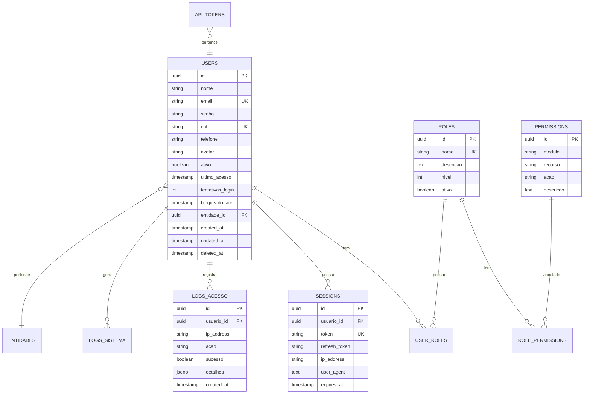

### 🏢 Domínio: EMPRESAS E MULTI-TENANT

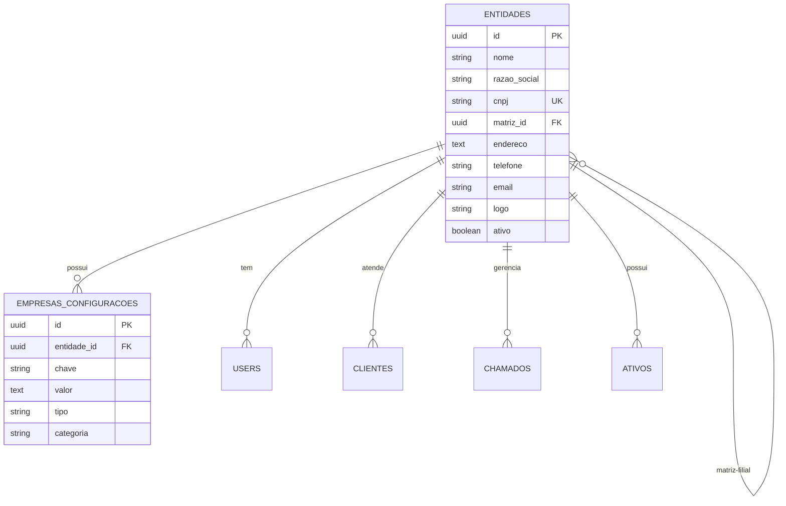

### 👥 Domínio: CLIENTES E ESTRUTURA ORGANIZACIONAL

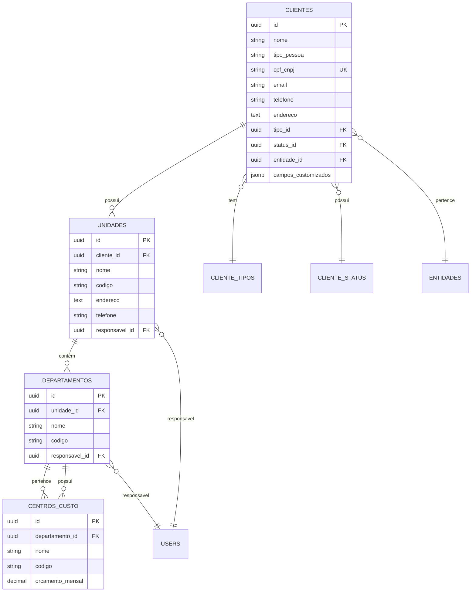

### 🎫 Domínio: CHAMADOS (TICKETS)

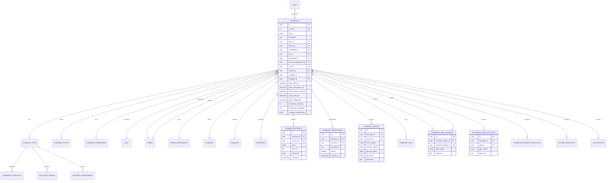

### ⏱️ Domínio: SLA (Service Level Agreement)

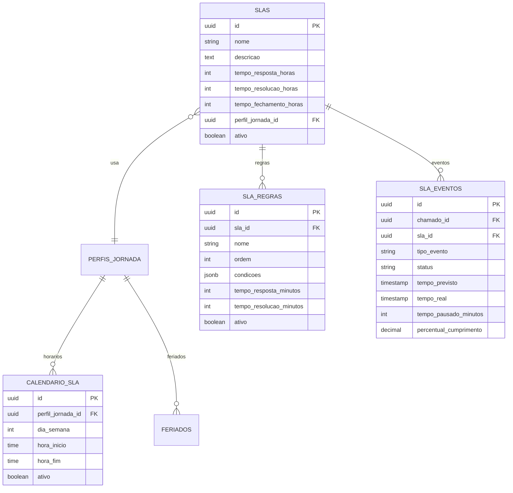

### 🎯 Domínio: ÁREAS E GRUPOS

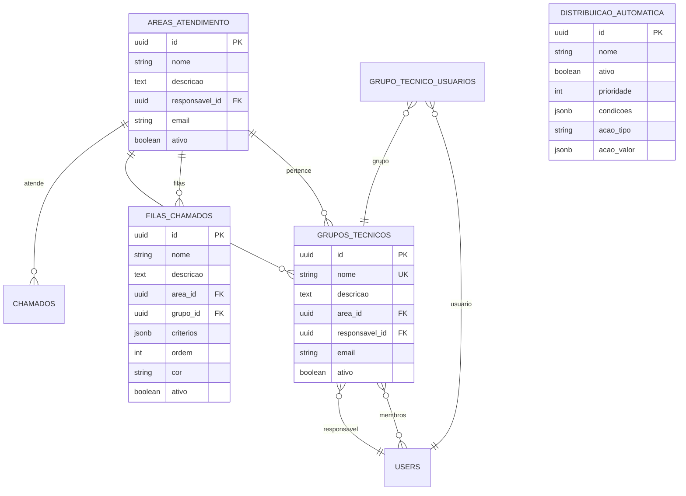

### 💻 Domínio: INVENTÁRIO DE ATIVOS

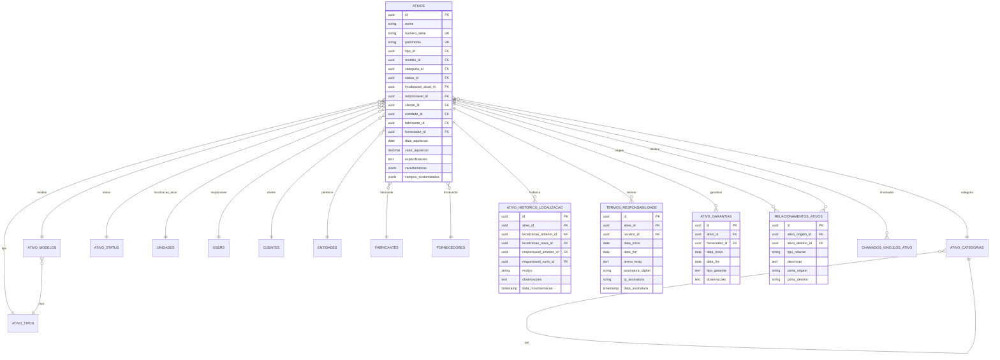

### 💾 Domínio: SOFTWARE E LICENÇAS

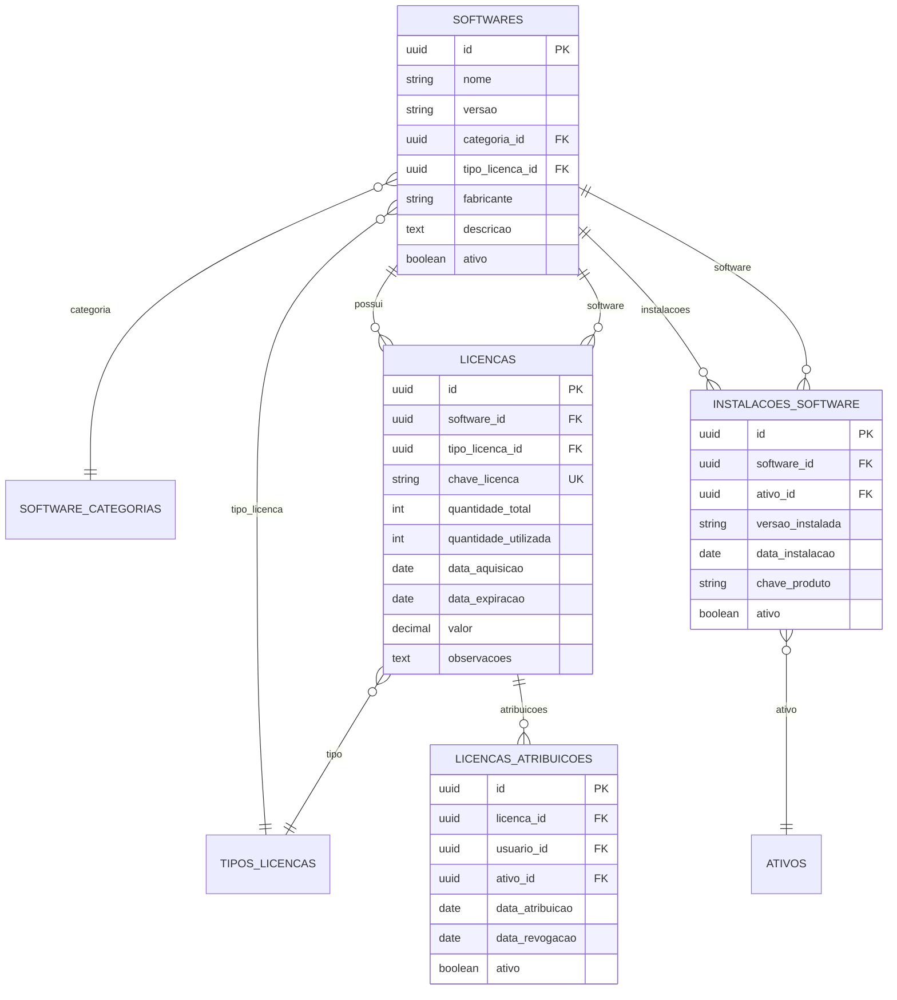

### 🔧 Domínio: CMDB (Configuration Management Database)

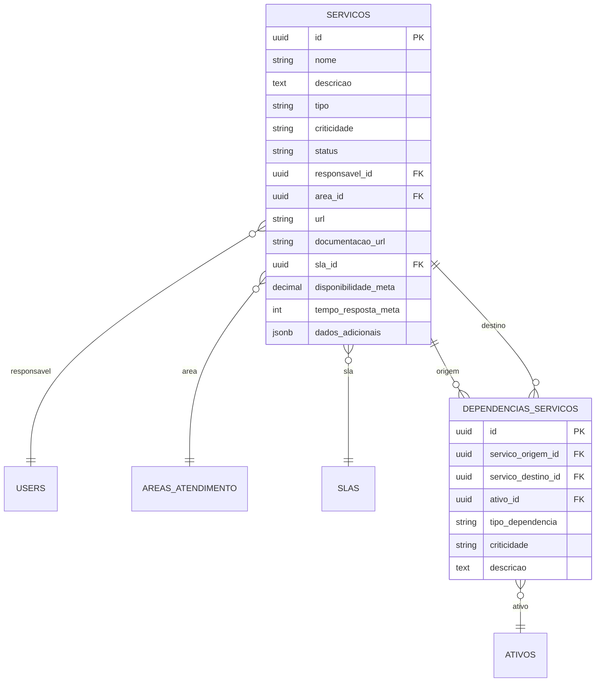

### 💡 Domínio: BASE DE CONHECIMENTO

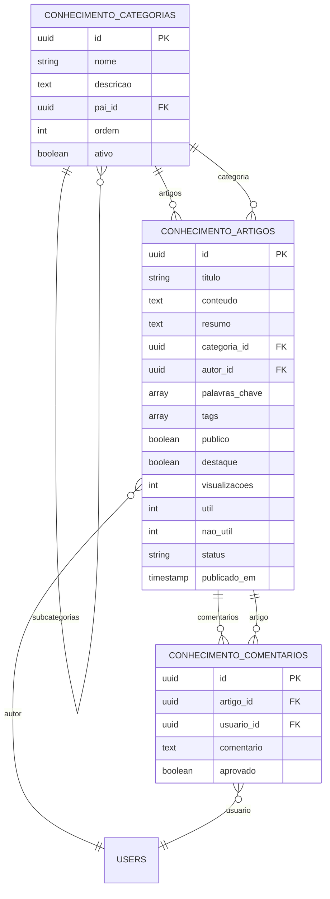

### 📝 Domínio: SOLUÇÕES E ROTEIROS

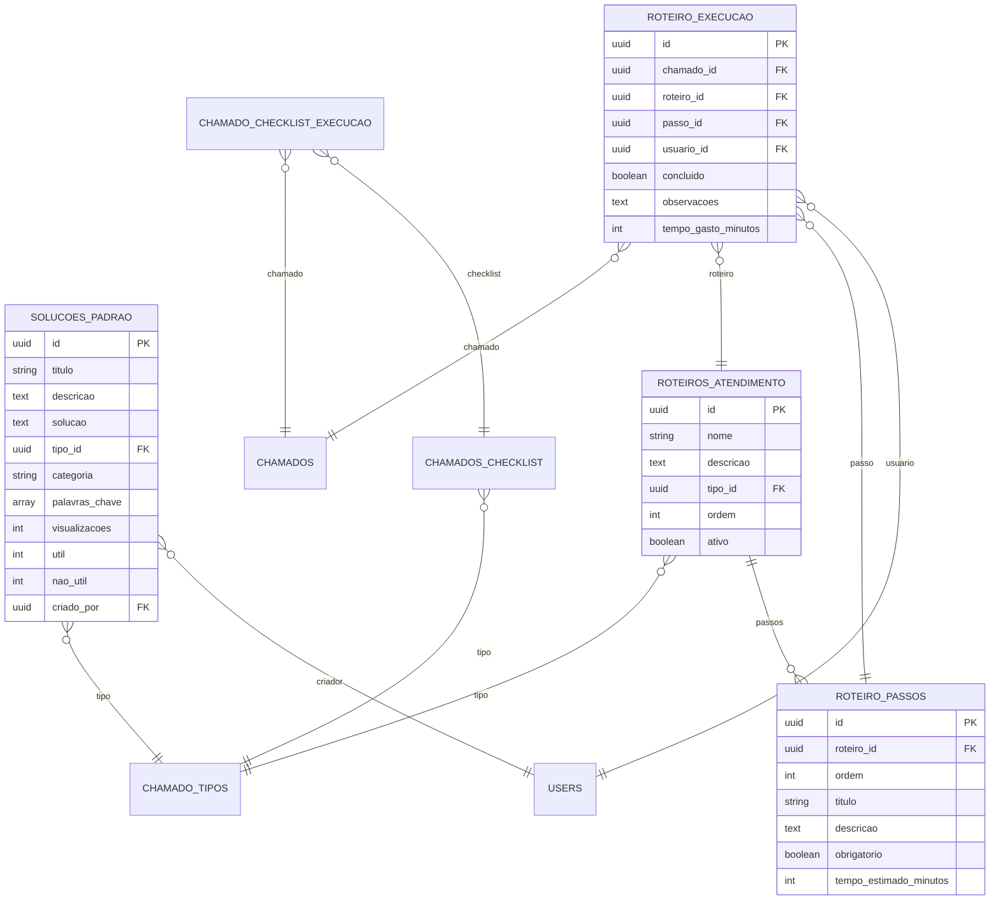

### ⚙️ Domínio: ADMINISTRAÇÃO E CONFIGURAÇÕES

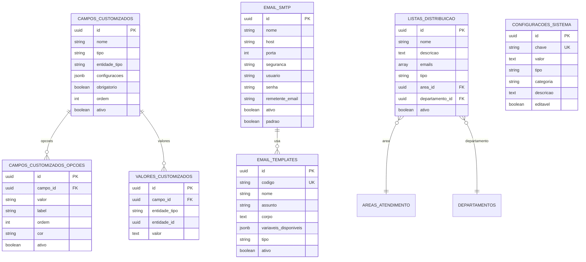

### 📊 Domínio: LOGS E AUDITORIA

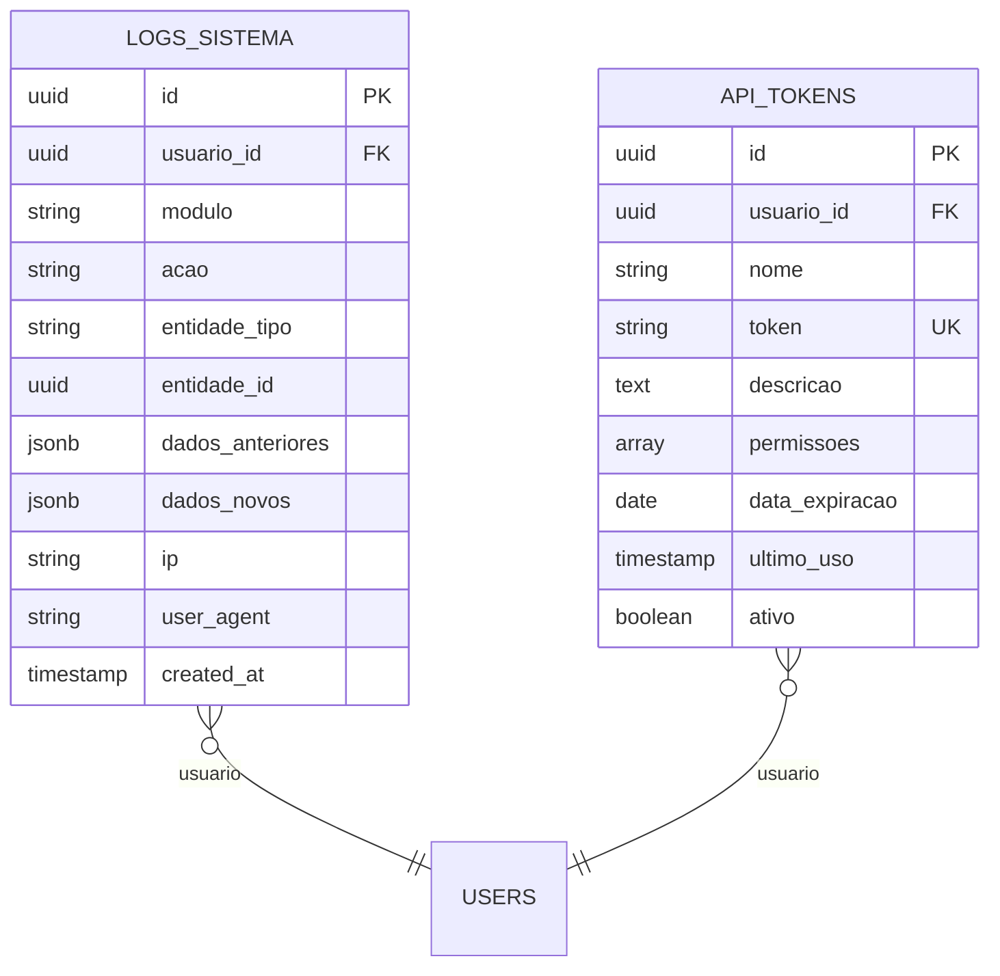

## Estatísticas do Banco de Dados

### 📈 Resumo por Domínio

| Domínio | Tabelas | Descrição |
|---------|---------|-----------|
| **Segurança** | 7 | Autenticação, permissões, logs de acesso |
| **Empresas** | 2 | Multi-tenant, configurações por empresa |
| **Clientes** | 6 | Clientes, unidades, departamentos, centros de custo |
| **Chamados** | 18 | Tickets, histórico, anexos, tags, relacionamentos |
| **SLA** | 6 | Service Level Agreement, eventos, calendário |
| **Áreas e Grupos** | 5 | Áreas de atendimento, grupos técnicos, filas |
| **Inventário** | 12 | Ativos, tipos, modelos, movimentações, garantias |
| **Software** | 6 | Softwares, licenças, instalações, atribuições |
| **CMDB** | 3 | Serviços, dependências, relacionamentos |
| **Conhecimento** | 3 | Base de conhecimento, artigos, comentários |
| **Soluções** | 6 | Soluções padrão, roteiros, checklist |
| **Administração** | 8 | Configurações, campos customizados, emails |

### 🔢 Totais

- **Total de Tabelas**: 82
- **Relacionamentos N:N**: 8
- **Relacionamentos 1:N**: 150+
- **Auto-relacionamentos**: 4 (entidades, categorias, serviços)
- **Tabelas com Soft Delete**: 45+
- **Índices Criados**: 100+
- **Views de Relatórios**: 7
- **Triggers**: 2 (timestamp, audit log)

### 🔑 Chaves e Constraints

- **Primary Keys**: UUID em todas as tabelas
- **Foreign Keys**: 200+ relações
- **Unique Keys**: 30+
- **Check Constraints**: 15+
- **Default Values**: Todos os timestamps, booleans, arrays

### 📊 Campos Padrão em Todas as Tabelas

```sql
id UUID PRIMARY KEY DEFAULT uuid_generate_v4()
created_at TIMESTAMP DEFAULT CURRENT_TIMESTAMP
updated_at TIMESTAMP DEFAULT CURRENT_TIMESTAMP
deleted_at TIMESTAMP (soft delete)
criado_por UUID (auditoria)
atualizado_por UUID (auditoria)
```

### 🎯 Campos JSONB para Flexibilidade

- **chamados.campos_customizados**
- **ativos.caracteristicas**
- **distribuicao_automatica.condicoes**
- **filas_chamados.criterios**
- **sla_regras.condicoes**
- **servicos.dados_adicionais**
- **email_templates.variaveis_disponiveis**

### 🔍 Índices Principais

- Email de usuários
- Número de chamados
- Número de série de ativos
- Token de sessão
- Status e prioridades
- Datas de SLA
- Relacionamentos (origem/destino)
- Logs por usuário e data

### 📌 Views Estratégicas

1. **vw_chamados_completo** - Chamados com todas as informações
2. **vw_chamados_estatisticas_status** - Estatísticas por status
3. **vw_tecnicos_performance** - Performance de técnicos
4. **vw_ativos_resumo** - Resumo de ativos por status/tipo
5. **vw_licencas_vencendo** - Licenças próximas do vencimento
6. **vw_inventario_localizacao** - Inventário por localização
7. **vw_chamados_sla_risco** - Chamados em risco de SLA

## 🔄 Relacionamentos Complexos

### Multi-Tenancy (Isolamento por Empresa)

```
ENTIDADES (empresa)
    ↓
    ├── USERS (usuários da empresa)
    ├── CLIENTES (clientes da empresa)
    ├── CHAMADOS (chamados da empresa)
    └── ATIVOS (ativos da empresa)
```

### Hierarquia de Clientes

```
CLIENTES
    ↓
UNIDADES (filiais, lojas)
    ↓
DEPARTAMENTOS (TI, RH, Vendas)
    ↓
CENTROS_CUSTO (projetos, contratos)
```

### Fluxo de Chamado

```
CHAMADO criado
    ↓
DISTRIBUICAO_AUTOMATICA → atribui grupo/técnico
    ↓
GRUPOS_TECNICOS → técnicos especializados
    ↓
SLA_EVENTOS → monitora prazos
    ↓
CHAMADO_HISTORICO → registra todas ações
    ↓
CHAMADO resolvido/fechado
```

### CMDB - Relacionamentos de Infraestrutura

```
SERVICOS (aplicação web)
    ↓ depende de
SERVICOS (banco de dados)
    ↓ hospedado em
ATIVOS (servidor físico)
    ↓ conectado a
ATIVOS (switch de rede)
```

## 💡 Casos de Uso Práticos

### 1. Abrir Chamado Completo

```sql
-- Inserir chamado
INSERT INTO chamados (...) VALUES (...);

-- Adicionar tags
INSERT INTO chamado_tags (chamado_id, tag_id) VALUES (...);

-- Vincular ativos afetados
INSERT INTO chamados_vinculos_ativo (chamado_id, ativo_id) VALUES (...);

-- Anexar arquivos
INSERT INTO chamado_anexos (chamado_id, ...) VALUES (...);

-- Registrar no histórico
INSERT INTO chamado_historico (...) VALUES (...);

-- Criar eventos de SLA
INSERT INTO sla_eventos (...) VALUES (...);
```

### 2. Movimentar Ativo

```sql
-- Atualizar ativo
UPDATE ativos 
SET localizacao_atual_id = :nova_localizacao,
    responsavel_id = :novo_responsavel
WHERE id = :ativo_id;

-- Registrar histórico
INSERT INTO ativo_historico_localizacao (...) VALUES (...);

-- Criar termo de responsabilidade
INSERT INTO termos_responsabilidade (...) VALUES (...);
```

### 3. Consultar Performance de Técnico

```sql
SELECT * FROM vw_tecnicos_performance
WHERE tecnico_id = :id;
```

### 4. Alertar Licenças Vencendo

```sql
SELECT * FROM vw_licencas_vencendo
WHERE dias_para_vencer <= 30;
```

## 🎨 Cores e Status Padrão

### Status de Chamados

- 🟠 **Aberto** - #FF9800
- 🔵 **Em Andamento** - #2196F3
- 🟡 **Aguardando** - #FFC107
- 🟢 **Resolvido** - #4CAF50
- ⚫ **Fechado** - #9E9E9E
- 🔴 **Cancelado** - #F44336

### Prioridades

- 🔴 **Crítica** - #F44336 (1h)
- 🟠 **Alta** - #FF9800 (4h)
- 🟡 **Média** - #FFC107 (8h)
- 🟢 **Baixa** - #4CAF50 (24h)

### Status de Ativos

- 🟢 **Disponível** - #4CAF50
- 🔵 **Em Uso** - #2196F3
- 🟠 **Manutenção** - #FF9800
- ⚫ **Estoque** - #9E9E9E
- 🔴 **Baixado** - #F44336
- 🟡 **Emprestado** - #FFC107

---

**Versão**: 1.2.0  
**Última Atualização**: 2026-02-13  
**Total de Entidades**: 82  
**Complexidade**: Enterprise-Grade
